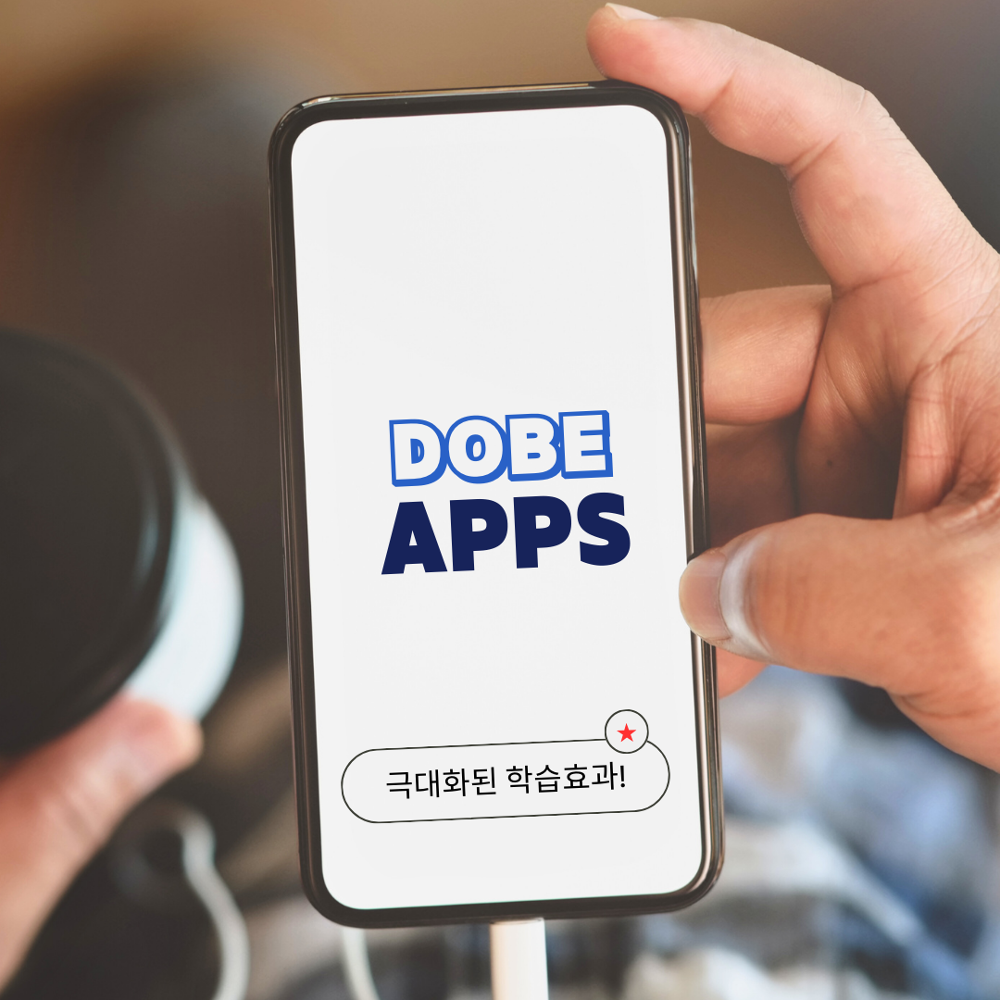
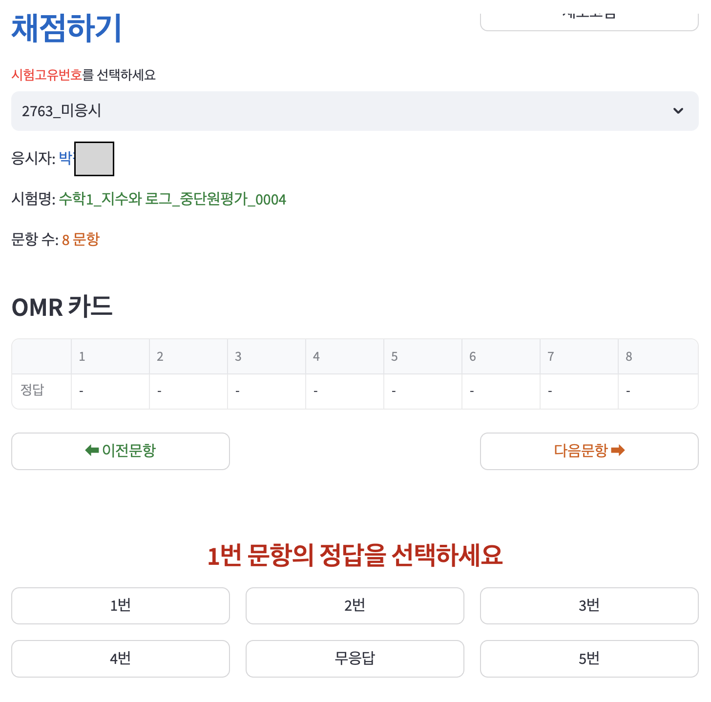
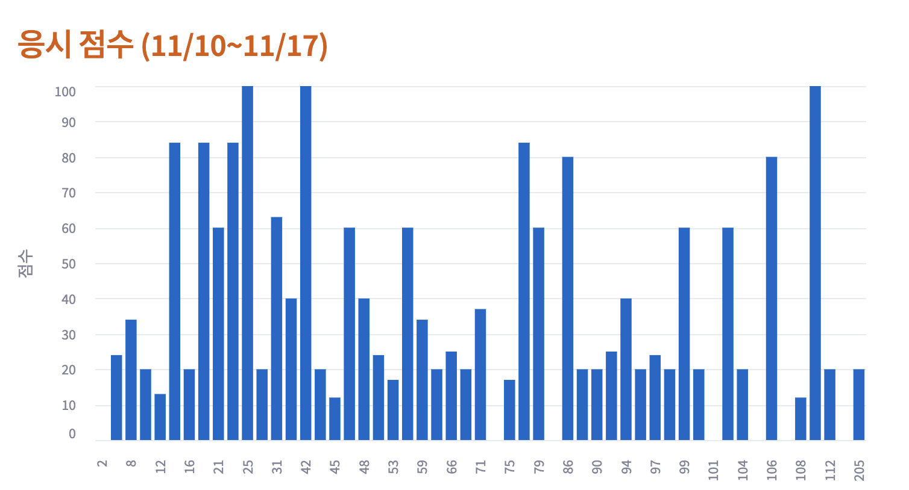
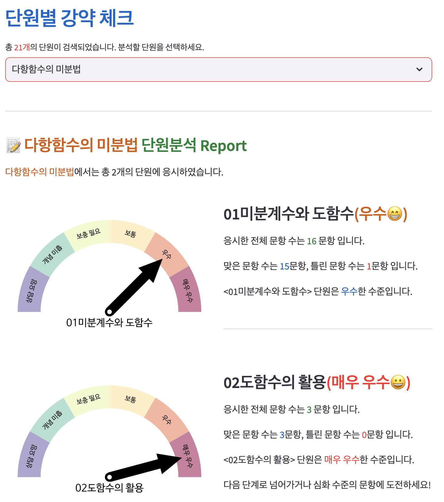
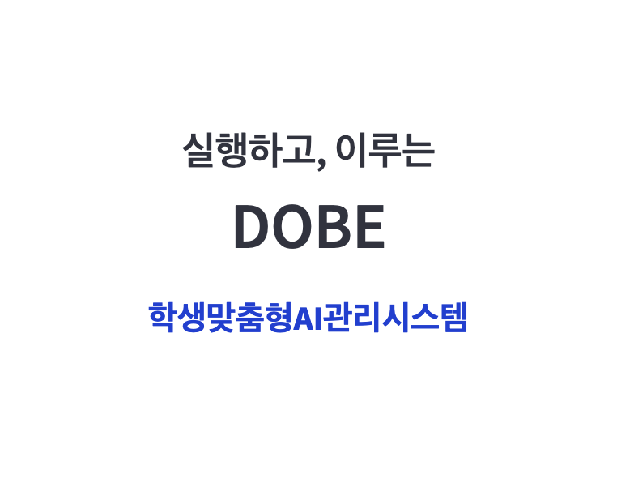
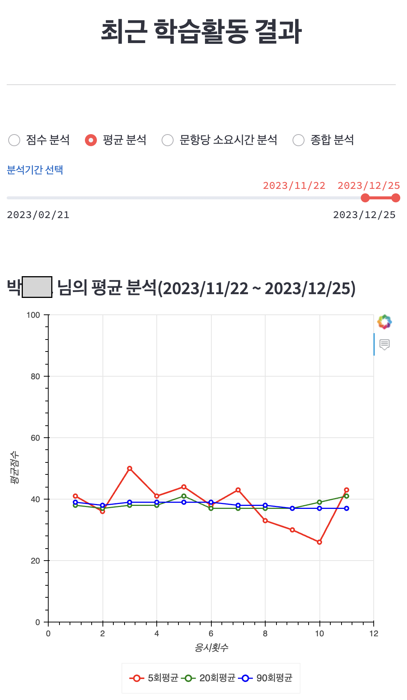
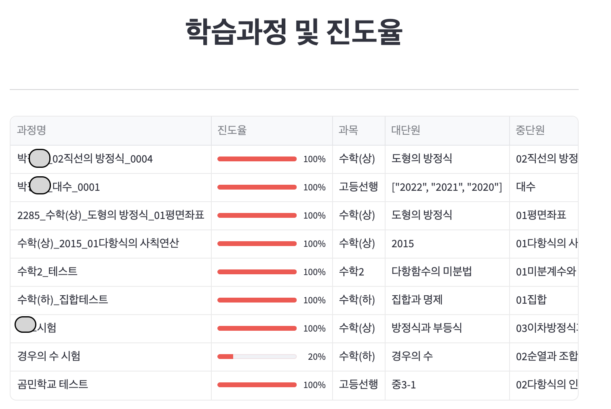

### [학생용 앱](https://iffstudy.streamlit.app)으로 이동
### [학부모님용 앱](https://iffparents.streamlit.app)으로 이동

# DOBE는 인공지능앱으로 모든 학습결과를 꼼꼼히 관리합니다.
#### 언제, 어디서나 학습지를 채점하고 실시간으로 결과를 확인할 수 있습니다.

#### 취약한 단원과 내용을 분석하고 오답시험지를 자동으로 생성해줍니다.

___
# 우리 아이, 열심히 하고 있을까?

#### DOBE는  학부모님 전용 어플을 통해 학생의 학습내역과 현재 수준을 실시간으로 제공해 드립니다.

## 학생의 눈부신 성장을 응원합니다.

### [학생용 앱](https://iffstudy.streamlit.app)으로 이동
### [학부모님용 앱](https://iffparents.streamlit.app)으로 이동

